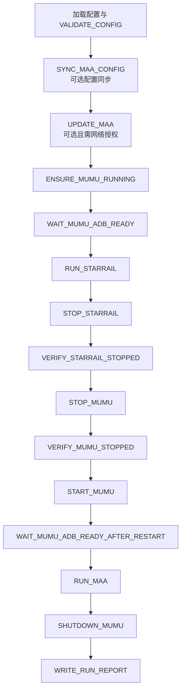

# OrchestratoRRR

> 面向 Windows 游戏工具链的外部任务编排与进程管理工具

OrchestratoRRR 用于按确定顺序管理 MuMu、StarRailCopilot、MAA 等外部程序的启动、等待、状态确认、任务执行与清理。项目的核心是多阶段工作流编排、Windows 进程生命周期管理、TCP/ADB 状态探测、配置安全同步，以及可审计的结构化运行结果。

它不是 AI 游戏 Agent，也不实现视觉识别、游戏内容识别或自动点击；具体业务自动化能力由外部工具提供，OrchestratoRRR 负责可靠地组织和约束这些工具。

**当前状态：可运行的工程原型。** 核心编排、进程管理、managed MuMu 生命周期和真实端到端工作流已有验收记录；当前生产计划已下线不稳定的 AALC/Limbus 链路，保留 StarRail、MAA 与最终 MuMu 清理。最新 ADB 恢复与失败清理修复已通过完整自动测试并重建打包制品，但尚未再次运行真实业务工作流。

## 核心能力

- **多阶段生产工作流**：不可变执行计划、managed/external MuMu 两种模式、惰性 Runtime 绑定，以及固定的阶段顺序与后置条件。
- **Deadline / Cancellation / Failure 传播**：父 Deadline 单调递减，子操作只能收紧预算；首个业务失败会阻断后续普通阶段，并保留稳定错误码。
- **Windows 进程树管理**：`ProcessSupervisor` 统一处理创建、等待、超时、取消和清理，使用 Windows Job Object 约束受管进程树。
- **MuMu 生命周期与 readiness**：启动、停止、重启、TCP 端口、ADB devices、device state 和 Android boot-completed 组合探测。
- **有界 ADB 恢复**：单条 ADB 命令默认最多占用 5 秒；受控 localhost connect 带冷却；持续 `DEVICE_OFFLINE` 时只回收精确目标 transport，并在最多一次 managed restart 前后各允许一次 endpoint recovery，全部共享原预算。
- **MAA 配置同步**：对白名单字段做转换和大小限制，使用临时文件、原子替换、备份与双目标失败回滚。
- **受限 MAA 更新**：默认关闭；启用时要求显式网络授权，只允许固定 `update` 入口并受 Deadline 约束。
- **可观测结果**：每次运行输出 JSONL 阶段事件和 schema v1 `RunReport`；报告先校验 JSON Schema，再原子落盘。
- **打包与桌面入口**：PyInstaller 6.21 onedir、资源审计、标准 LOCALAPPDATA 布局、Start Menu `start` 入口和交互式真实执行确认。
- **工程验证**：pytest Fake/mock 测试覆盖进程、探针、Runtime、工作流、CLI、打包与安装边界，并使用 Ruff 和 strict mypy 做静态检查。

## 当前生产流程

managed 模式的默认生产计划共有 15 个阶段，顺序由源码中的 `planning.build_plan()` 与 `run_application.MANAGED_RUN_STAGES` 共同锁定：



这条顺序表达了一个明确的生命周期边界：

1. 先校验配置，并按配置决定是否同步或更新 MAA。
2. 确认 MuMu 与 ADB readiness 后运行 StarRailCopilot。
3. StarRail 完成后停止并重新启动 MuMu，为 MAA 提供干净实例。
4. MAA 完成后关闭整个 MuMu，最后写入 RunReport。
5. managed 实例已被本次运行接管后，若业务阶段失败或超时，会在写报告前额外尝试一次有界 `SHUTDOWN_MUMU`；cleanup 失败只作为 secondary failure，不覆盖原始错误。

external 模式不拥有 MuMu 生命周期，会从默认计划中移除 stop/start/restart/shutdown 阶段，只验证外部已启动实例的 readiness。AALC/Limbus 已从 managed 和 external 生产计划、执行器分发与路径校验中下线；旧配置段和历史 Adapter 暂时保留用于兼容与追溯。

## 设计分层

| 层 | 主要职责 |
|---|---|
| `process/` | CreateProcessW、句柄管理、Job Object、进程等待与终止升级 |
| `probes/` | TCP、ADB 解析与 MuMu readiness 分类 |
| `runtime/` | MuMu、StarRailCopilot、MAA 的外部程序适配与稳定结果模型 |
| `maa_sync/` / `maa_update/` | 配置转换、原子同步、备份回滚与受限更新策略 |
| `workflow/` | 执行计划、Stage executor、失败传播、managed cleanup 与生产组合根 |
| CLI / entry | 配置预检、UAC 重入、真实执行确认、打包入口与失败通知 |
| reporting | JSONL 事件、StageReport、RunReport 和 schema 校验 |

## 系统要求

- Windows 10 或更高版本；
- Python 3.11 或更高版本；
- PowerShell 5.1 或 PowerShell 7；
- 由使用者单独安装并配置 MuMu、ADB、StarRailCopilot 与 MAA；
- 建议使用项目独立虚拟环境。

项目包含 Windows API 绑定和 Job Object 实现，不以 Linux/macOS 为运行目标。

## 安装

### 源码开发环境

```powershell
git clone https://github.com/tony1155/OrchestratoRRR.git
Set-Location OrchestratoRRR

python -m venv .venv
.\.venv\Scripts\Activate.ps1
python -m pip install -e ".[dev,packaging]"
```

### 构建 onedir

```powershell
.\scripts\build-package.ps1
```

正式构建入口使用版本控制中的 `packaging/OrchestratoRRR.spec`，输出：

```text
dist/
└─ OrchestratoRRR/
   ├─ OrchestratoRRR.exe
   └─ _internal/
```

这是 PyInstaller **onedir** 制品，不能只复制单个 EXE。

### 首次安装默认入口

```powershell
$sourceOnedir = (Resolve-Path '.\dist\OrchestratoRRR').Path
.\scripts\install-default-entry.ps1 -SourceOnedir $sourceOnedir
```

首次安装脚本会拒绝覆盖非空安装目录或已有快捷方式。标准布局为：

| 内容 | 路径 |
|---|---|
| 程序 | `%LOCALAPPDATA%\Programs\OrchestratoRRR` |
| 配置 | `%LOCALAPPDATA%\OrchestratoRRR\config\orchestrator.toml` |
| 工作目录 | `%LOCALAPPDATA%\OrchestratoRRR\runtime` |
| 日志 | `%LOCALAPPDATA%\OrchestratoRRR\logs` |
| 报告 | `%LOCALAPPDATA%\OrchestratoRRR\run-results` |

安装后 Start Menu 快捷方式直接执行 `OrchestratoRRR.exe start`。已有安装的更新采用“产品数据备份 + hash/manifest 前置条件 + 同目录事务替换”流程，脚本入口见 `scripts/backup-product-data.ps1` 与 `scripts/update-default-entry.ps1`。

## 配置

复制示例配置并填入本机路径：

```powershell
Copy-Item config\orchestrator.example.toml config\orchestrator.local.toml
```

`orchestrator.local.toml` 已被 Git 忽略。以下片段只展示当前生产链路的关键字段；路径和实例号必须按实际安装修改：

```toml
[orchestrator]
log_dir = "logs"
report_dir = "run-results"

[mumu]
lifecycle_mode = "managed"
executable = "C:\\path\\to\\MuMuManager.exe"
adb_executable = "C:\\path\\to\\adb.exe"
adb_serial = "127.0.0.1:<PORT>"
start_timeout_seconds = 120
stop_timeout_seconds = 20
start_arguments = ["control", "-v", "<INSTANCE>", "launch"]
stop_arguments = ["control", "-v", "<INSTANCE>", "shutdown"]

[starrail]
executable = "C:\\path\\to\\StarRailCopilot\\toolkit\\python.exe"
working_directory = "C:\\path\\to\\StarRailCopilot"
arguments = ["gui.py", "--run", "src", "--port", "22367"]
log_path_template = "C:\\path\\to\\StarRailCopilot\\log\\{date}_src.txt"
task_timeout_seconds = 3600
stop_timeout_seconds = 10

[maa]
executable = "C:\\path\\to\\MAA\\MAA.exe"
working_directory = "C:\\path\\to\\MAA"
arguments = []
timeout_seconds = 1800
stop_timeout_seconds = 10

[maa_sync]
enabled = false
backup_enabled = true

[maa_update]
enabled = false
allow_network = false
arguments = ["update"]
timeout_seconds = 3600
```

配置边界：

- managed 模式要求显式、非空的 MuMu start/stop 参数；external 模式反而禁止这些参数。
- `validate --check-paths` 会验证当前生产链路所需的可执行文件和目录。
- 标准 `start` 入口要求业务路径为绝对路径，并要求 log/report 精确匹配 canonical LOCALAPPDATA 目录。
- `maa_sync` 和 `maa_update` 默认关闭；更新只有在 `allow_network=true` 时才允许执行。
- 旧 `[aalc]` 配置仍可被解析，但不参与当前生产计划，也不再阻断生产路径。

## 基础使用

### 无业务副作用的命令

```powershell
python -m autogame_orchestrator version

python -m autogame_orchestrator validate `
  --config config\orchestrator.local.toml `
  --check-paths

python -m autogame_orchestrator plan `
  --config config\orchestrator.local.toml
```

`validate` 和 `plan` 不启动 MuMu、ADB 或业务程序；`plan` 输出固定 dry plan。

### 运行生产工作流

```powershell
python -m autogame_orchestrator run `
  --config config\orchestrator.local.toml `
  --deadline-seconds 7200 `
  --confirm-real-execution <EXACT_CONFIRMATION>
```

真实执行必须使用有限 Deadline 和精确确认值。不要把确认值写进配置文件、脚本模板或标准快捷方式。

打包后的交互入口：

```powershell
.\dist\OrchestratoRRR\OrchestratoRRR.exe start
```

`start` 会执行 canonical 路径预检、展示实际计划与风险提示，并在用户输入确认后调用同一个正式 run 边界。打包版交互运行失败时，程序会在 RunReport 写入后显示一个不含设备地址、命令行或原始 ADB 输出的失败提示。

## 日志与 RunReport

- JSONL 日志按 run id 写入，记录工作流开始和每个阶段的稳定 outcome/error code。
- 每个 `StageReport` 包含阶段名、结果、错误码、时间和白名单 diagnostics。
- `RunReport` 使用 `schemas/run-report-v1.schema.json` 校验并通过 `os.replace` 原子落盘。
- cleanup outcome 会作为二级诊断写入，但不会覆盖导致工作流停止的原始失败。
- serial、PID、原始 stdout/stderr 和真实执行确认不会进入 MuMu 的公开诊断投影。

## 测试与质量门禁

```powershell
python -m pytest -q
python -m ruff check .
python -m ruff format --check .
python -m mypy src
```

最近一次完整本地门禁结果：

```text
pytest      1442 passed, 1 skipped
ruff lint  passed
mypy src   passed (69 source files)
```

测试默认使用 Fake/mock 子进程与合成探针，不需要启动 MuMu、StarRailCopilot 或 MAA。

## 项目结构

```text
src/autogame_orchestrator/
├─ process/              Windows 进程、Job Object、Deadline 与监督器
├─ probes/               TCP、ADB 与 MuMu readiness
├─ runtime/              MuMu、StarRailCopilot、MAA 等 Runtime Adapter
├─ maa_sync/             MAA 配置转换、原子写入与回滚
├─ maa_update/           受限 MaaCore/资源更新配置
├─ workflow/             计划、Runner、生产执行器与清理策略
├─ diagnostics/          受限诊断和隔离打包 smoke
├─ cli.py                Typer CLI
└─ default_entry.py      原生打包入口策略

scripts/                 构建、安装、产品数据备份与安全更新
packaging/               PyInstaller onedir spec 与入口
schemas/                 RunReport JSON Schema
tests/                   单元、Fake、边界和打包测试
docs/                    架构、阶段计划、验收证据和手工门禁
```

## 验收概况

已经有证据支持的范围：

- StarRailCopilot、MAA 和历史 AALC Adapter 的真实进程生命周期 smoke；
- external 模式的真实完整工作流；
- managed MuMu 冷启动、停止、重启、ADB ready、最终 shutdown 和进程回收；
- 两次 managed 真实完整工作流成功记录，其中一次从干净进程基线启动并验证 player born 2 / reaped 2 / leaked 0；
- PyInstaller onedir、schema 资源、默认入口、首次安装和带产品数据保护的安装更新；
- 当前不含 AALC 的 15 阶段计划、失败 cleanup、ADB child deadline、精确 endpoint recycle 和 offline recovery 的完整自动测试。

为避免夸大：最近的 ADB/offline 修复只进行了自动测试和打包重建，没有重新执行真实业务工作流；历史 AALC 在线业务任务也从未被声明为完成，并且现已从生产流程下线。

## 已知限制

- **仅支持 Windows。** Win32 进程 API、Job Object、UAC 和快捷方式均为核心实现的一部分。
- **依赖外部工具契约。** StarRailCopilot 日志格式、MuMuManager CLI、ADB 行为或 MAA 参数变化都可能需要适配。
- **第三方任务可能自身卡住。** 历史上 MAA Recruit 曾出现上游页面导航循环；编排器只能通过 Deadline 有界终止，不能修复 MaaCore 的识别/点击逻辑。
- **MAA update 不是完整事务。** 上游安装器会原地清理并解压资源；中断后通常依赖下次 update 或 MAA GUI 覆盖安装恢复，因此该能力默认关闭。
- **ADB 恢复是刻意受限的。** 不会 kill/restart 全局 ADB server，也不会扫描或断开其他设备；精确 endpoint recycle 最多两次、managed restart 最多一次，仍未恢复时会按 start timeout 失败。
- **取消路径的 cleanup 仍需完善。** 已取得 managed 所有权后的 failure/timeout 会执行有界 shutdown；当前顶层 `CANCELLED` 状态尚未进入同一 failure-cleanup 分支，取消后应人工确认 MuMu 状态。
- **最新恢复修复尚未真实回归。** ADB 5 秒 child deadline、精确 endpoint recycle、offline 单次重启和失败通知已通过自动测试并进入打包制品，但没有再次运行真实 workflow。
- **仍有少量格式债务。** 全仓 Ruff lint 与 mypy 通过；`ruff format --check .` 当前仍报告 4 个历史文件，仅为格式差异，不影响测试结果。

## 详细文档

README 只保留稳定的产品与工程概览，详细阶段和事故证据在以下文档中：

- [架构说明](docs/architecture.md)
- [阶段规划与历史状态](docs/phase-plan.md)
- [累积维护与修复日志](docs/maintenance-log.md)
- [全部验收记录](docs/acceptance/)
- [managed MuMu 生命周期真实验收](docs/acceptance/phase-6b2b3c-managed-mumu-lifecycle.md)
- [打包默认入口人工确认边界](docs/acceptance/phase-7d4c-manual-shortcut-preflight-cancellation.md)
- [ADB 单命令 timeout 修复](docs/acceptance/2026-08-17-mumu-adb-command-timeout-recovery.md)
- [managed DEVICE_OFFLINE recovery 与失败 cleanup](docs/acceptance/2026-08-17-managed-mumu-device-offline-recovery.md)

## License

本项目使用 MIT License。
